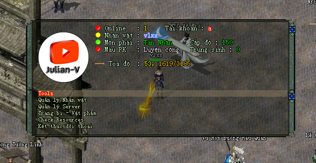
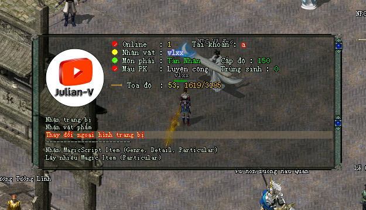
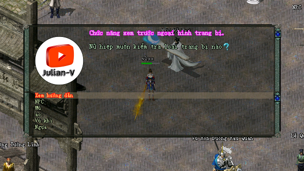

# jx-offline

[](https://youtube.com/julianv "Julian-V")

[](/) [](#jx-offline) [](https://github.com/julianv22/jx-offline/actions/workflows/main.yml) [](https://github.com/julianv22/jx-offline/commits/main) [](https://github.com/julianv22/jx-offline/releases) [](#)

# README 

### Yêu cầu cần thiết:

Đã cài đặt jx-offline của [PYTA GAMING](https://www.youtube.com/watch?v=do5mFT4M3wc) phiên bản 8.2.

### Cần lưu ý:

Tương thích tốt nhất với phiên bản 8, những phiên bản khác có thể có những thay đổi trong **settings** dẫn đến kết quả sẽ khác khi sử dụng để lấy các item.

> Đây chỉ là phần code nhỏ của một vài tính năng chứ không phải **full code**.

# Hướng dẫn cài đặt

+ Tải bản release mới nhất [](https://github.com/julianv22/jx-offline/archive/refs/heads/main.zip) về và giải nén. Sau đó copy vào **client** và **server**.

[](#) Ngoài thư mục ***script, spr*** và file ***settings/maplist.ini*** ra thì các file và thư mục khác có thể không sao chép cũng được.

+ Các file này chỉ bao gồm những chỉnh sửa nhỏ không đáng kể và không làm thay đổi trải nghiệm.

+ [Add [Cẩm nang AIO]](#add-c%E1%BA%A9m-nang-aio-v%C3%A0o-magicscript) theo hướng dẫn bên dưới.

+ Reset server và trải nghiệm.

### Demo:







# Add [Cẩm nang AIO] vào [magicscript](client/settings/item/004/magicscript.txt)

Add dòng này vào cuối file **magicscript.txt**

| A | B | C | D | E | F | G | H | I | J | K | L | M | N | O | P | Q | R | S | T | U | V | W | X | Y | Z | AA | AB | AC | AD |
| - | - | - | - | - | - | - | - | - | - | - | - | - | - | - | - | - | - | - | - | - | - | - | - | - | - | - | - | - | -|
| CÈm nang AIO | 6 | 1 | 5128 | \spr\item\longmenbiaoju\»¤ïÚÁî.spr | 341 | 1 | 1 | CÈm nang tÊt c¶ trong mét. Writen by <bclr=blue>Julian-V<bclr> |  | 0 | 1 | 0 | \script\global\gm\julianv\main.lua | 0 | 1 | 1 | 0 | 1 |  | 0 | 0 | 0 | 0 | 0 | 0 | 0 | 0 | 0 | 0 |

**Copy code:**
```js	
CÈm nang AIO	6	1	5128	\spr\item\longmenbiaoju\»¤ïÚÁî.spr	341	1	1	CÈm nang tÊt c¶ trong mét. Writen by <bclr=blue>Julian-V<bclr>		0	1	0	\script\global\gm\julianv\main.lua	0	1	1	0	1		0	0	0	0	0	0	0	0	0	0
```

[](#) Item Id của lệnh bài là: ***{6,	1,	5128}*** có thể thay đổi tuỳ theo magicscript.txt của bạn.

# Tài liệu

https://jxdocs.com/admin

https://fb.com/groups/volamquan

https://www.fb.com/groups/pytagaming1

# Linh tinh

### [install.ps1](install.ps1)

Quick install work environments with PowerShell

### [settings-font.json](settings-font.json)

Setting font in VsCode

File Font: **.VnSourceCodePro-Regular.ttf**

### License
[Lua](https://www.lua.org/license.html)
